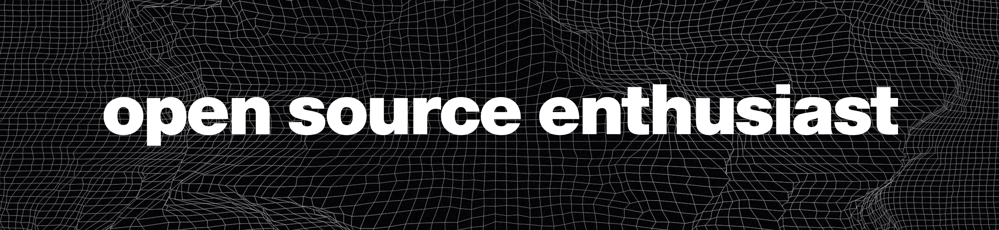

# Hello! I'm Smit 👋
🛠️ currently working on [dotl](https://github.com/smit4k/dotl) & [conversia](https://github.com/smit4k/conversia)   🧑‍🎓 junior in high school   💻🎨 software development & ui/ux design

# Tech Used

